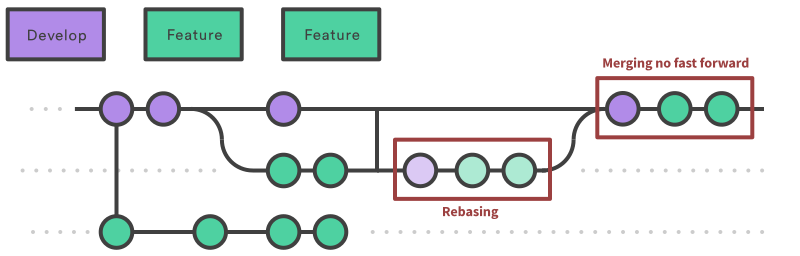

[**Naming + GitFlow || LisoFlow (explained?)**](./readme.md)

# Branching system

[1. GitFlow](#GitFlow)  
[2. LisoFlow](#LisoFlow)  
___
  
### GitFlow
> Gitflow Workflow is a Git workflow design that was first published and made popular by Vincent Driessen at nvie.  
> Defines a strict branching model designed around the project release.  
> Is ideally suited for projects that have a scheduled release cycle.

Credits and great documentaiton with more detail explanations from Atlasian's approach: [GitFlow](https://www.atlassian.com/git/tutorials/comparing-workflows/gitflow-workflow)  

#### Getting started  
We can install the git flow workflow to run native commands on the terminal  
`brew install git-flow`

And start up a project by running  
`git flow init`  
> Git-flow is a wrapper around Git. The git flow init command is an extension of the default git init command and doesn't change anything in your repository other than creating branches for you.

#### How it works
It all starts with a master and a develop branch. All work will be synced and shared on develop. Master will be used to keep track of releases only.

```
$ git flow init
Initialized empty Git repository in ~/project/.git/
No branches exist yet. Base branches must be created now.
Branch name for production releases: [master]
Branch name for "next release" development: [develop]

How to name your supporting branch prefixes?
Feature branches? [feature/]
Release branches? [release/]
Hotfix branches? [hotfix/]
Support branches? [support/]
Version tag prefix? []

$ git branch
* develop
 master
```  

#### Branching  

  

> Feature branches are generally created off to the latest develop branch.  
Create feature branch by running  

Without gitflow extension:
```
$ git checkout develop
$ git checkout -b feature_branch
```  

With gitflow extension:
```
$ git flow feature start feature_branch
```  

#### Finishing a feature
Without gitflow extension:
```
$ git checkout develop
$ git merge feature_branch
```  

With gitflow extension:
```
$ git flow feature finish feature_branch
```  

#### Releases
  

When we start a release branch, no further features can be pushed to it, and a release cycle is started. The intention behind this practice is to allow other team members to keep on working on new features, while a clean release is prepared with a set ammount of new features for the next version.  

> Once it's ready to ship, the release branch gets merged into master and tagged with a version number. In addition, it should be merged back into develop, which may have progressed since the release was initiated.  

Without gitflow extension:
```
$ git checkout develop
$ git checkout -b release/0.1.0
```  

With gitflow extension:
```
$ git flow release start 0.1.0
Switched to a new branch 'release/0.1.0'
```  

And when the release is ready to ship, all bugs addressed, all QA is done, and we get a green light, the release is merged into master and develop. Then the release branch is deleted. To finish a release we run…  

Without gitflow extension:
```
$ git checkout master
$ git merge release/0.1.0
```  

With gitflow extension:
```
$ git flow release finish '0.1.0'
```  

#### Hotfixes  
  

Hotfixes are intended for patching released versions.
The main difference between a hotfix branch, and release or feature branches, is that these are based on master, and not develop. As soon as it's ready it should be merged back into both master and develop. Master should then be tagged also with a new version.  
Same as release branches, this process allows the team to work on separate threads addressing bugs while at the same time keep working on new features.  

Without gitflow extension:
```
$ git checkout master
$ git checkout -b hotfix_branch
```  

With gitflow extension:
```
$ git flow hotfix start hotfix_branch
```  

When the hotfix is done, we finish it up and put it back to develop and master.

Without gitflow extension:
```
$ git checkout master
$ git merge hotfix_branch
$ git checkout develop
$ git merge hotfix_branch
$ git branch -D hotfix_branch
```  

With gitflow extension:
```
$ git flow hotfix finish hotfix_branch
```  

To sum it all up, a basic flow description should look like this:  
1. A develop branch is created from master  
2. A release branch is created from develop  
3. Feature branches are created from develop  
4. When a feature is complete it is merged into the develop branch  
5. When the release branch is done it is merged into develop and master  
6. If an issue in master is detected a hotfix branch is created from master  
7. Once the hotfix is complete it is merged to both develop and master  
___ 

### LisoFlow   
> Common git workflow based on feature branches with a rebase/merge no fast forward technique.
> NK Git Styleguide covers a similar approach very nicely, check the link in [conclusion page](./conclusion.md).  
> Is ideally suited for small projects with short life cycle and for smaller team (or even a single developer).  

  

Any other features could be used, like creating a release branch, or merging back to master for releases. This is a bit flexible and can be scaled up depending on the project's needs.  

They key factor of this approach is to keep a commit history strict to time based. Using `--no-ff` on merge commands makes git keep all history of commits in the merge, making develop a longer track of single commits, instead of merge messages where the ownership of commits might change with merge commands.  

#### Branching
Start by pulling develop from origin into your develop and creating a feature branch:
```
$ git pull
$ git checkout -b feature/feature_branch
```  

When the magic is done and your branch is ready to be shared with the team, rebase ur branch with origin develop. But make sure to do a fetch so local git is aligned with origin.
```
$ git fetch origin
$ git rebase origin/develop
```  

Any conflicts between origin and local copies should be addressed now. Given that we are rebasing, git will try to handle conflicts by one commit at a time, making conflict fixing much easier. For every file we fix a conflict we need to add to index and continue rebasing.
```
$ git add file_with_conflicts_fixed
$ git rebase --continue
```  
> If more than one file got conflicts on a single commit rebase,make sure to fix all conflicts on all files before adding to index and continuing rebasing.  
> Otherwise if things get out of control, you can always stop the process and start over by runnign `$ git rebase --abort`

When rebasing is done, we know for a fact that our branch will smoothly make into develop, since we fixed all conflicts already and our branch is now same as develop, but with our changes ON TOP. So we move back into develop, sync with origin, and merge our feature in from here.  
```
$ git checkout develop
$ git pull
$ git merge --no-ff feature/feature_branch
$ git push
```
> If for some reason a push has been made to origin develop while we were rebasing/merging we will know when we pull before merge. So before merging, we go back to our feature branch and repeat the process of rebasing. Then back to develop and continue the flow.  
  
___  

### But what about pull requests?  
Great question.  
Pull requests are just great.
They actually work quite well with both approaches. It usually works best when you are unsure about a feature and you want support before merging it into develop, or when -for archiving purposes- you want to track a merge of a big feature.  
Sometimes you want to keep track on specific changes within a merge, creating a pull request even for yourself, and to comment on each changed line are great features.  
  
  

[Previous](./naming.md) – [Next](./conclusion.md)